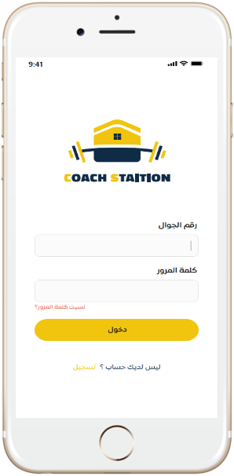

# Coach Station Trainer (Flutter Application)

It is a sports application that allows the Trainers to view the list of classes and financial dues.

## Features

* allow trainers to view list of classes with more detials.
* view current and expired financial dues
* view profile with the ability to:
  * view the training places.
  * view certificates.
* update profile.
* possibility to change the language.

#### Code Quality

* Write readable and reusable code.
* Use single responsibility for the classes and functions.
* Work with models.
* Easy to modify user interface.

## Screenshots

&nbsp;

&nbsp;

&nbsp;

&nbsp;

&nbsp;

#### Dependencies:
- flutter_localizations
- provider
- webview_flutter
- firebase_messaging
- firebase_core
- shared_preferences
- dio
- pull_to_refresh
- flutter_launcher_icons

# What's Next?
 - [X] Add backend.
 - [ ] Testing App.